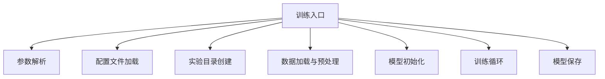
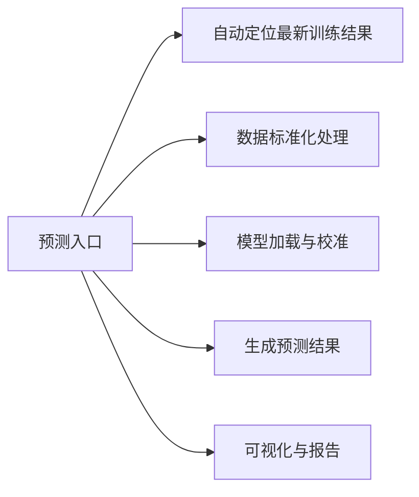
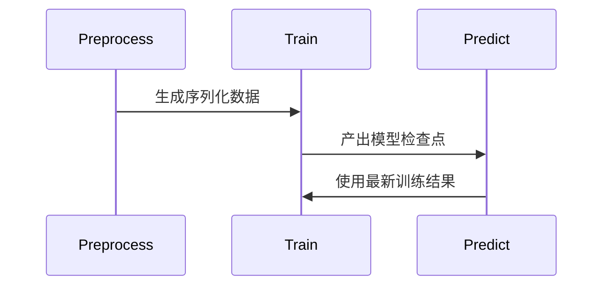

# 锂离子电池RUL预测项目入口分析

## 三大核心入口脚本

### 1. 模型训练入口 (`train_baselines.py` 和 `train.py`)


#### 关键参数设计：
```python
# train_baselines.py 支持多种基线模型
parser.add_argument(
    "--model", 
    type=str, 
    required=True,
    choices=['rnn', 'lstm', 'gru', 'transformer', 'saetr'],
    help="选择训练模型类型"
)

# train.py 专用于SAETR模型
parser.add_argument(
    "--config", 
    type=str, 
    default="configs/config.yaml",
    help="配置文件路径"
)
```

#### 执行流程：
1. 创建带时间戳的实验目录
2. 加载并预处理序列数据
3. 初始化模型架构
4. 执行训练循环（含早停机制）
5. 保存最佳模型和训练配置

### 2. 预测评估入口 (`predict.py`)


#### 关键特性：
- 自动检测最新训练目录
- 保形预测区间校准
- 电池级预测轨迹可视化
- 多维度评估报告生成

### 3. 预处理入口 (`preprocess.py`)
```python
# 命令行调用示例
python preprocess.py --config configs/config.yaml
```

#### 处理流程：
1. 从`data/final_dataset/`加载原始CSV
2. 执行滑动窗口序列化处理
3. 保存NPY文件到`data/processed/`
4. 生成元数据文件`meta_*.csv`

## 入口间调用关系


## 配置系统集成
所有入口脚本均通过`--config`参数加载统一配置：
```yaml
# configs/config.yaml 关键配置项
paths:
  data_dir: "data/final_dataset"
  processed_dir: "data/processed"
  experiment_base_dir: "train_results"

model_params:
  d_model: 128
  nhead: 4
  quantiles: [0.1, 0.5, 0.9]

train_params:
  batch_size: 128
  patience: 20
```

## 实验结果管理
```bash
# 训练产出目录结构
train_run_20251012_054025/
├── checkpoints/
│   ├── best_model.pth
│   ├── scaler.json
│   └── train_config.json
└── predictions/
    ├── battery_statistics.csv
    ├── per_battery_traces/
    └── test_scatter_pred_vs_true.png
```

## 扩展接口设计
```python
# 自定义模型扩展点 (baseline_models.py)
class CustomModel(nn.Module):
    def __init__(self, input_dim, qs=(0.1, 0.5, 0.9)):
        super().__init__()
        # 实现自定义架构
        self.qs = qs
        
    def forward(self, x):
        # 返回形状为 [batch_size, 3] 的预测
        return quantile_predictions