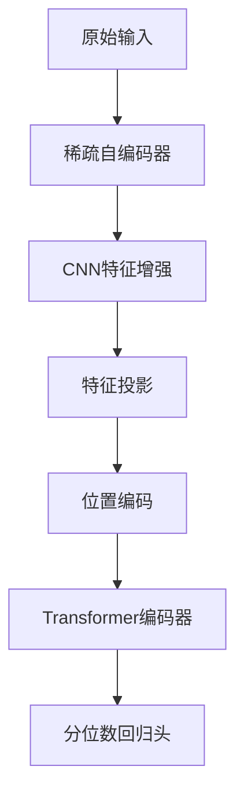

# 锂离子电池RUL预测核心逻辑解析

## SAETR模型架构


## 核心处理流程

### 1. 稀疏自编码器 (SAE)
```python
class SAE(nn.Module):
    def __init__(self, in_dim, hid=64, out_dim=32):
        self.enc = nn.Sequential(
            nn.Linear(in_dim, hid), 
            nn.ReLU(), 
            nn.Linear(hid, out_dim)
        )
        self.dec = nn.Sequential(...)
    
    def forward(self, x):
        z = self.enc(x)  # 特征压缩
        xrec = self.dec(z)  # 输入重建
        return z, xrec
```
- 输入: (B, L, F) 电池序列数据
- 输出: 
  - z: (B, L, sae_dim) 压缩特征
  - xrec: (B, L, F) 重建输入

### 2. CNN特征增强 (可选)
```python
if self.use_cnn:
    z = z.transpose(1, 2)  # (B, C, L)
    z = self.cnn(z)  # 1D卷积处理
    z = z.transpose(1, 2)  # (B, L, C)
```
- 使用1D卷积捕捉局部时序模式
- 增强特征表达能力

### 3. Transformer编码
```python
class TransEncoder(nn.Module):
    def __init__(self, d_model, nhead, nlayers):
        self.enc = nn.TransformerEncoder(...)
    
    def forward(self, x):
        h = self.enc(x)  # (B, L, d_model)
        return h[:, -1, :]  # 取最后时间步
```
- 位置编码注入时序信息
- 多头注意力捕捉长期依赖
- 输出最后时间步的上下文表示

### 4. 分位数回归
```python
def pinball_loss(pred, target, qs=(0.1, 0.5, 0.9)):
    e = target - pred
    loss = 0.0
    for i, q in enumerate(qs):
        loss += torch.mean(torch.maximum(q * e[:, i], (q - 1) * e[:, i]))
    return loss / len(qs)
```
- 同时预测多个分位数(0.1, 0.5, 0.9)
- 使用pinball loss优化分位数预测
- 提供预测区间估计

## 创新点设计

### 1. 联合优化目标
```
总损失 = 分位数损失 + α*重建损失 + β*稀疏损失
```
- 分位数损失: 主预测任务
- 重建损失: 保证特征可解释性
- 稀疏损失: 提升特征判别力

### 2. 保形预测校准
```python
def conformal_calibrate(q_lo, q_md, q_hi, y_true, tau=0.8):
    rad = np.maximum(q_md - q_lo, q_hi - q_md)
    miss = np.maximum(np.abs(y_true - q_md) - rad, 0.0)
    alpha = np.quantile(miss, tau)
    return alpha
```
- 在验证集上校准预测区间
- 确保测试集覆盖率达到预设τ值
- 增强预测可靠性

## 数据流时序
```mermaid
sequenceDiagram
    输入数据->>SAE: 原始序列 (B,L,F)
    SAE->>CNN: 压缩特征 z
    CNN->>投影层: 增强特征
    投影层->>位置编码: 投影特征
    位置编码->>Transformer: 时序增强
    Transformer->>回归头: 上下文表示
    回归头-->>输出: 分位数预测 (q_lo, q_md, q_hi)