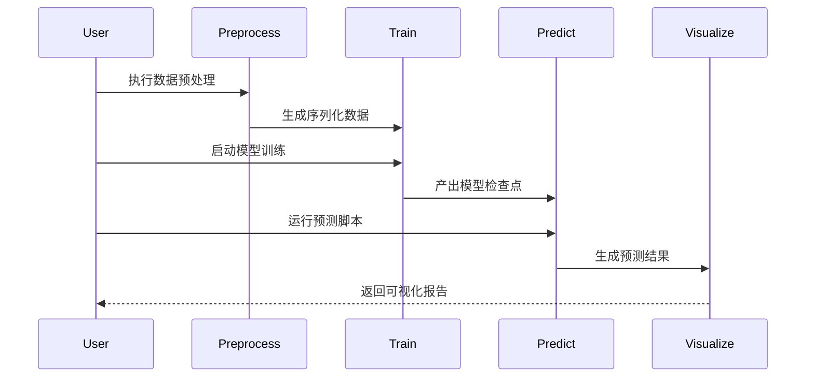
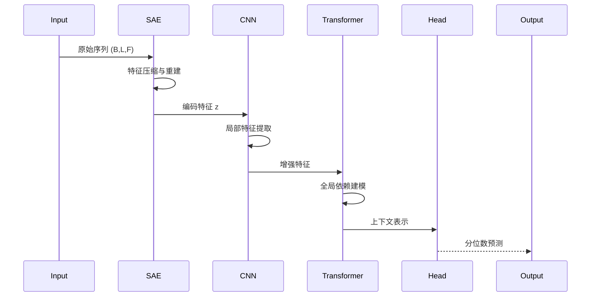
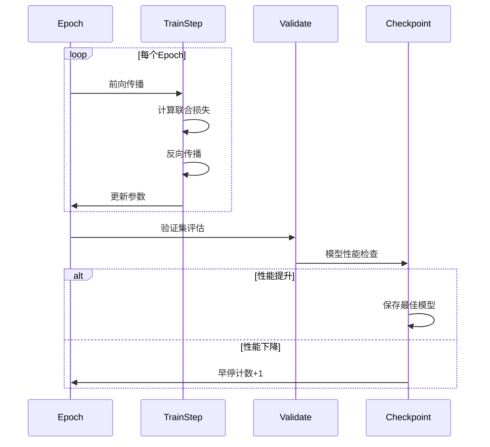

# 锂离子电池RUL预测系统时序图

## 端到端工作流程

## 模型推理时序

## 训练过程时序

## 关键时序说明
1. **数据预处理阶段**:
   - 原始CSV转换为标准化NPY序列
   - 生成元数据文件记录电池信息

2. **训练循环**:
   - 每个epoch包含完整的前向/反向传播
   - 验证集评估触发模型检查点保存
   - 连续`patience`次无改进触发早停

3. **预测阶段**:
   - 自动加载最新训练结果
   - 保形预测校准区间
   - 电池级轨迹可视化生成