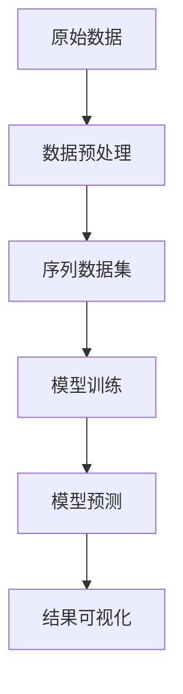

# 电池寿命预测项目实现方法文档

## 1. 项目概述
本项目基于SAETR（Sparse Autoencoder + Transformer）架构实现电池剩余使用寿命（RUL）预测，支持与RNN/LSTM/GRU/Transformer等基线模型对比。核心创新点在于结合稀疏自编码器的特征压缩能力和Transformer的时序建模能力，通过分位数回归实现预测区间估计。

---

## 2. 系统架构


---

## 3. 核心模块实现

### 3.1 数据预处理 (`preprocess.py`)
```python
def main(args):
    # 加载配置
    with open(args.config, 'r') as f:
        config = yaml.safe_load(f)
    
    # 1. 加载原始CSV数据
    df_train = add_cycle_frac(load_split("train"))
    
    # 2. 特征工程（添加cycle_frac）
    df_train["cycle_frac"] = df_train["cycle_index"] / max_cycle
    
    # 3. 创建滑动窗口序列
    X, y, meta = make_seq(df, feature_cols, window=100, stride=10)
    
    # 4. 保存标准化后的序列数据
    np.save("seq_X_train.npy", X)
```

**关键技术点**：
- 滑动窗口生成：窗口长度100，步长10
- 特征标准化：使用`StandardScaler`进行全局标准化
- 元数据保存：记录每个序列对应的电池ID和起止周期

---

### 3.2 模型架构 (`model.py`)

#### 3.2.1 SAETR模型结构
```python
class SAETR(nn.Module):
    def __init__(self, F, sae_dim=32, d_model=128, nhead=4, use_cnn=True):
        super().__init__()
        # 稀疏自编码器
        self.sae = SAE(F, hid=2*sae_dim, out_dim=sae_dim)
        
        # 可选CNN层
        if use_cnn:
            self.cnn = nn.Sequential(
                nn.Conv1d(sae_dim, 64, kernel_size=3, padding=1),
                nn.ReLU()
            )
        
        # Transformer编码器
        self.proj = nn.Linear(sae_dim, d_model)
        self.pos = SinusoidalPositionalEncoding(d_model)
        self.tr = TransEncoder(d_model, nhead, nlayers=2)
        
        # 分位数回归头
        self.head = QuantileHead(d_model, qs=(0.1, 0.5, 0.9))
```

#### 3.2.2 多目标损失函数
```python
def forward(self, x):
    z, xrec = self.sae(x)  # 稀疏编码
    # CNN特征增强
    if self.use_cnn:
        z = self.cnn(z.transpose(1,2)).transpose(1,2)
    
    # Transformer处理
    h = self.proj(z)
    h = self.pos(h)
    h_last = self.tr(h)
    
    # 三合一损失计算
    loss_main = pinball_loss(q, yb)  # 分位数损失
    loss_rec = nn.SmoothL1Loss()(xrec, xb)  # 重构损失
    loss_sp = z.abs().mean()  # 稀疏正则
    return loss_main + 0.5*loss_rec + 0.1*loss_sp
```

**创新设计**：
1. 特征压缩：SAE将原始特征从F维压缩到32维
2. CNN增强：可选1D CNN增强局部特征提取
3. 位置编码：`SinusoidalPositionalEncoding`保留时序信息
4. 多任务学习：联合优化预测、重构和稀疏性

---

### 3.3 训练流程 (`train_baselines.py`)

#### 3.3.1 训练优化策略
```python
optimizer = torch.optim.AdamW(model.parameters(), lr=1e-3)
scheduler = ReduceLROnPlateau(optimizer, factor=0.5, patience=5)

for epoch in range(100):
    # 训练阶段
    train_loss = train_epoch(model, dl_tr, optimizer)
    
    # 验证阶段
    val_mae = validate(model, Xva, yva)
    
    # 动态调整
    scheduler.step(val_mae)
    if val_mae < best_val_mae:
        torch.save(model.state_dict(), "best_model.pth")
```

**关键参数**：
- 批量大小：64
- 学习率：1e-3（带衰减机制）
- 早停策略：连续10个epoch验证集无改进则停止

---

### 3.4 预测与评估 (`predict_baselines.py`)

#### 3.4.1 保形校准算法
```python
def conformal_calibrate(q_lo, q_md, q_hi, y_true, tau=0.8):
    rad = np.maximum(q_md - q_lo, q_hi - q_md)
    miss = np.maximum(np.abs(y_true - q_md) - rad, 0.0)
    alpha = np.quantile(miss, tau)  # 计算校准系数
    return alpha
```

**评估流程**：
1. 在验证集上计算校准系数alpha
2. 调整测试集预测区间：`pred_lo = q_lo - alpha`, `pred_hi = q_hi + alpha`
3. 生成四类结果：
   - 散点图（预测vs真实值）
   - 分位数覆盖图
   - 电池级预测曲线
   - 统计报告（MAE/RMSE/MAPE）

---

## 4. 实验管理

### 4.1 文件组织结构
```
experiments/
└── train_run_saetr_20251021_102532/
    ├── checkpoints/
    │   ├── best_model.pth
    │   ├── scaler.json
    │   └── train_config.json
    └── predictions/
        ├── battery_statistics.csv
        ├── test_scatter_pred_vs_true.png
        └── per_battery_traces/ [EL150800460436.png, ...]
```

### 4.2 关键配置文件 (`configs/config.yaml`)
```yaml
model_params:
  sae_dim: 32
  d_model: 128
  nhead: 4
  quantiles: [0.1, 0.5, 0.9]

train_params:
  batch_size: 64
  learning_rate: 0.001
  patience: 10
```

---

## 5. 创新点总结
1. **多模态特征提取**：SAE+CNN+Transformer三级特征处理架构
2. **不确定性量化**：分位数回归+保形校准实现可靠预测区间
3. **稀疏正则约束**：通过L1正则提升特征表示的可解释性
4. **模块化设计**：统一训练框架支持SAETR与主流基线模型对比

---