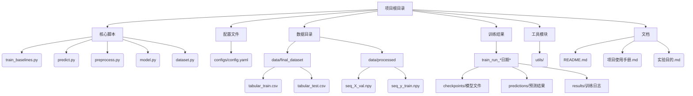

# 锂离子电池RUL预测项目结构分析

## 目录结构概览

## 核心组件说明

### 1. 核心脚本
- `train_baselines.py`: 基线模型训练入口脚本
- `predict.py`: 模型预测执行脚本
- `preprocess.py`: 数据预处理管道
- `model.py`: 深度学习模型架构定义
- `dataset.py`: PyTorch数据加载器实现

### 2. 数据流
- **原始数据存储**: `data/final_dataset/` (CSV格式)
  - tabular_train.csv: 训练集原始数据
  - tabular_test.csv: 测试集原始数据
- **预处理数据**: `data/processed/` (NPY格式)
  - 序列化处理后的训练/验证/测试数据

### 3. 训练产出
- 每个训练运行生成独立目录 (按时间戳区分)
  - `checkpoints/`: 模型检查点文件 (.pth)
  - `predictions/`: 
    - 电池级预测结果 (CSV)
    - 可视化图表 (PNG)
    - 统计报告 (txt)
  - `results/`: 
    - 训练日志 (log/csv)
    - 损失曲线/MAE曲线 (PNG)

### 4. 配置系统
- `configs/config.yaml`: 集中管理:
  - 模型超参数
  - 数据路径配置
  - 训练参数
  - 预测设置

### 5. 辅助工具
- `utils/`: 工具函数模块
- 文档体系:
  - `README.md`: 项目概览
  - `项目使用手册.md`: 操作指南
  - `实验目的.md`: 研究目标说明